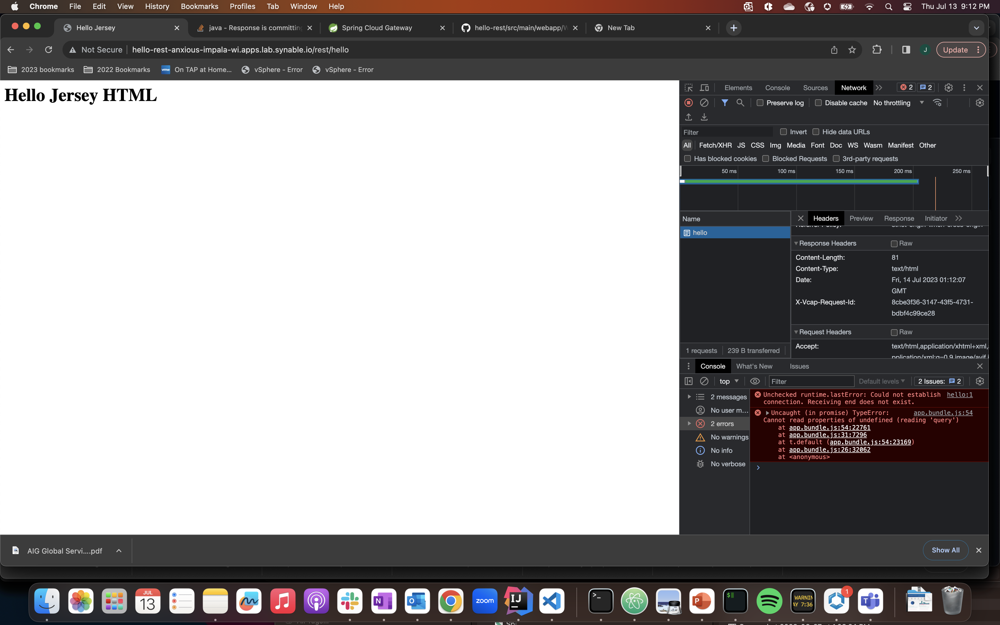
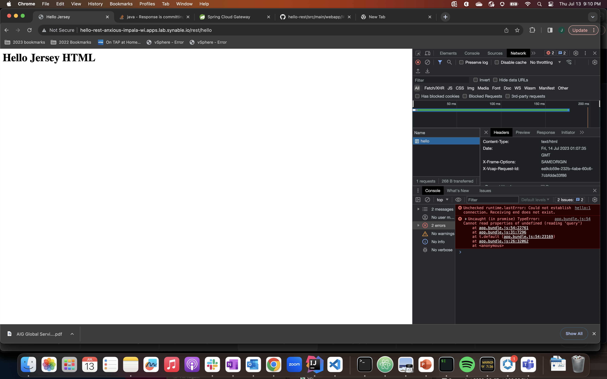

# hello-rest

    A jersey rest project which  exposes a RESTFUL get to return a greeting

this project has three branches.
```
main branch: does not set the X-Frame-Options field in the response header
Secure branch: sets the X-Frame-Options field by adding a new servlet filter and referencing it in the WEB-INF/web.xml
```

# deployment instructions - main branch - insecure
* this implementation does not add x-frame-options to the http header
```
git checkout main
gradle build
cf push
open app in browser, header does not include X-Frame-Options (see following image)
```


# deployment instructions - Secure branch - secured by security Filter
* this implementation uses a java security filter to add the x-frame-options to the http header 
```
git checkout Secure
gradle build
cf push
open app in browser, header DOES include X-Frame-Options (see following image)
```



# deployment instructions - Secure branch - secured by spring security
* this implementation uses spring-security to add the x-frame-options to the http header
```
git checkout  spring-security
gradle build
cf push
open app in browser, header DOES include X-Frame-Options (see following image)
```


# deployment instructions - secure branch -  Secured by Spring Cloud Gateway
* this implementation uses spring cloud gateway to add the x-frame-options to the http header
* this implementation requires Spring Cloud Gateway to be installed in your foundation 
### edit scg2.yaml as appropriate for your project, replace `{your.apps.domain}` with your apps.domain 

### convert yaml to json to pass to spring cloud gateway instance
```
yq scg2.yaml -o=json | jq -c > scg1.json
	
cf create-service p.gateway standard my-gateway -c scg1.json
``` 
or subsequently 
```
cf update-service my-gateway -c scg1.json
```

get url of gateway in the browswer and open the url with the specified prefix in the browser

http://<scg-url>/ext/hello


# references:
This application is based on the application described in this link:
https://www.javatpoint.com/jax-rs-example-jersey

This application References this sample for adding a servlet filter via the web.xml
https://digitalocean.com/community/tutorials/java-servlet-filter-example-tutorial

This application references this link to deliver a working example of X-Frame-Options in the response header 
https://stackoverflow.com/questions/11025605/response-is-committing-and-dofilter-chain-is-broken

